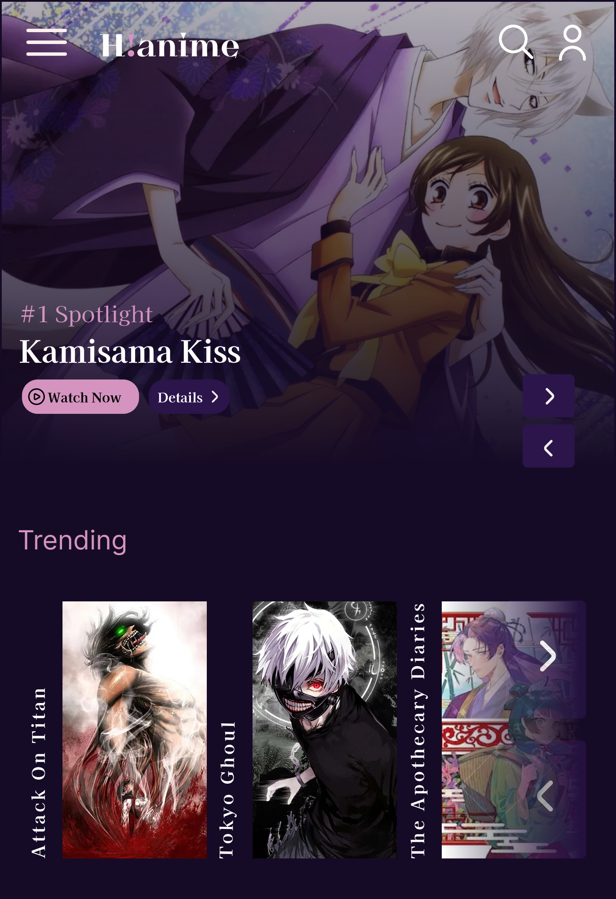

# HiAnime Mobile Home Page Redesign

A conceptual mobile UI/UX redesign for the **HiAnime** platform. This project focuses on enhancing the browsing experience, streamlining navigation, and maintaining a sleek, immersive anime-centric aesthetic.

---

## 📱 UI Preview

---

## ✨ Project Goals

* **Dynamic Hero Section:** Featured anime with quick-play and "Add to List" functionality.
* **Improved Content Discovery:** Categorized sections for "Trending," "New Releases," and "Top Airing."
* **Mobile-First Navigation:** Optimized bottom navigation bar for easy thumb reach.
* **Dark Mode Optimization:** Deep blacks and high-contrast accents to reduce eye strain during late-night viewing.

---

## 🛠️ Tools Used

* **Design:** Figma
* **Assets:** Flaticon
* **Typography:** Kyiv*Type Titling, Kaisei Opti

---

## 📂 How to Use This Repo

1.  **Mockups:** Check the `/mockups` folder for full-length high-resolution exports.
2.  **Assets:** All icons and custom graphics are available in the `/assets` folder.
3.  **Source:** The `.fig` file is available in the root directory for local editing.
